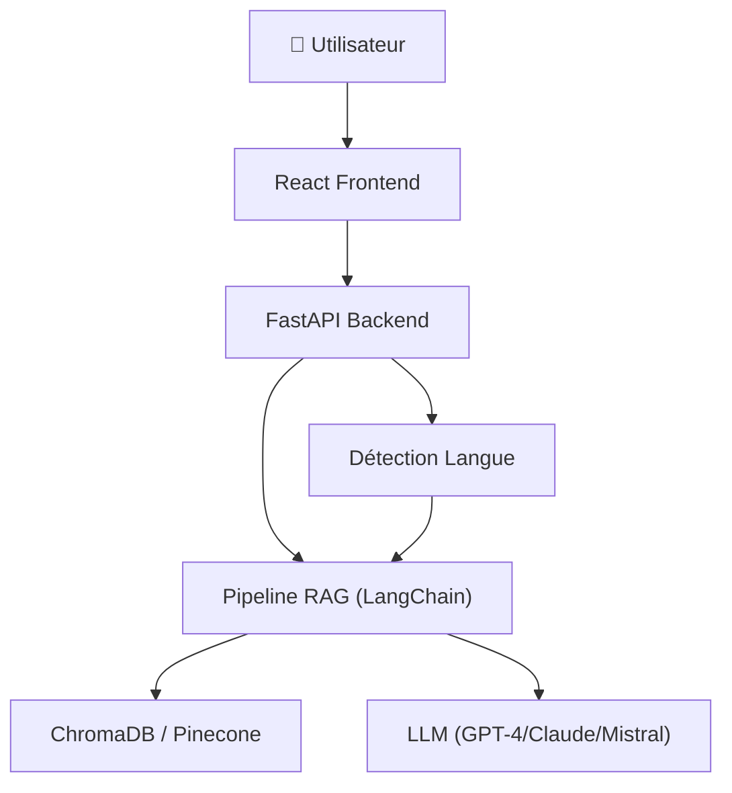
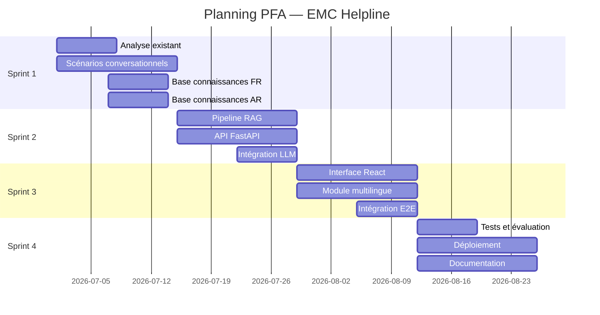

# 🛡️ Guide Projet — Chatbot IA Multilingue EMC Helpline

## Vue d'ensemble

| Élément | Détail |
|---------|--------|
| **Projet** | Chatbot IA multilingue d'assistance aux victimes de cyberviolences |
| **Structure** | CMRPI — Espace Maroc Cyberconfiance (EMC) |
| **Étudiants** | Salma Said & Mohamed Tamzirt (Data & AI Engineering) |
| **Encadrants** | M. Anass Bentaleb (IA) & Mme Fadwa Belaous (Psychologie) |
| **Durée** | 01 Juillet — 30 Août 2026 (8 semaines) |

---

## 📄 Livrables générés

### Rapport LaTeX → PDF (24 pages)
- [rapport_projet.tex](docs/rapport_projet.tex) — source LaTeX (structure complète,
  diagramme d'architecture TikZ, captures d'écran de l'interface, métriques mesurées)
- [rapport_projet.pdf](docs/rapport_projet.pdf) — 24 pages, compilé avec succès

> [!TIP]
> Pour recompiler : `cd docs && pdflatex rapport_projet.tex && pdflatex rapport_projet.tex`
> (deux passes : table des matières et références croisées)

> [!IMPORTANT]
> Les encadrés oranges « À compléter » signalent les sections restant à rédiger
> par les auteurs (remerciements, introduction, conclusion, analyses détaillées).

### Plan de sprints (`plan/`)

```
plan/
├── sprint1/   (S1-S2: Analyse & Base de connaissances)
│   ├── task1.md  — Analyse de l'existant (Salma + Mohamed)
│   ├── task2.md  — Scénarios conversationnels (Salma + Mohamed)
│   ├── task3.md  — Base de connaissances FR (Salma)
│   └── task4.md  — Base de connaissances AR (Mohamed)
├── sprint2/   (S3-S4: Moteur IA & Backend)
│   ├── task1.md  — Pipeline RAG / LangChain (Salma)
│   ├── task2.md  — API FastAPI (Mohamed)
│   └── task3.md  — Intégration LLM + Prompts (Salma + Mohamed)
├── sprint3/   (S5-S6: Interface & Multilingue)
│   ├── task1.md  — Interface React frontend (Mohamed)
│   ├── task2.md  — Module multilingue / traduction (Salma)
│   └── task3.md  — Intégration end-to-end (Salma + Mohamed)
└── sprint4/   (S7-S8: Tests & Documentation)
    ├── task1.md  — Tests & évaluation (Salma + Mohamed)
    ├── task2.md  — Optimisation & déploiement (Mohamed)
    └── task3.md  — Documentation & rapport final (Salma)
```

---

## ⚖️ Répartition équitable du travail

| Responsabilité | Salma Said | Mohamed Tamzirt |
|---|---|---|
| Analyse existant | ✅ Collaboratif | ✅ Collaboratif |
| Scénarios conversationnels | ✅ Collaboratif | ✅ Collaboratif |
| Base de connaissances FR | ✅ Principal | — |
| Base de connaissances AR | — | ✅ Principal |
| Pipeline RAG (LangChain) | ✅ Principal | — |
| API Backend (FastAPI) | — | ✅ Principal |
| Intégration LLM | ✅ Collaboratif | ✅ Collaboratif |
| Interface React | — | ✅ Principal |
| Module multilingue | ✅ Principal | — |
| Intégration E2E | ✅ Collaboratif | ✅ Collaboratif |
| Tests & évaluation | ✅ Collaboratif | ✅ Collaboratif |
| Déploiement | — | ✅ Principal |
| Documentation | ✅ Principal | — |

> **Salma** : 5 tâches principales + 4 collaboratives
> **Mohamed** : 5 tâches principales + 4 collaboratives

---

## 🏗️ Architecture technique



**Stack** : React · FastAPI · LangChain · ChromaDB/Pinecone · GPT-4/Claude/Mistral

---

## 📅 Timeline des sprints


